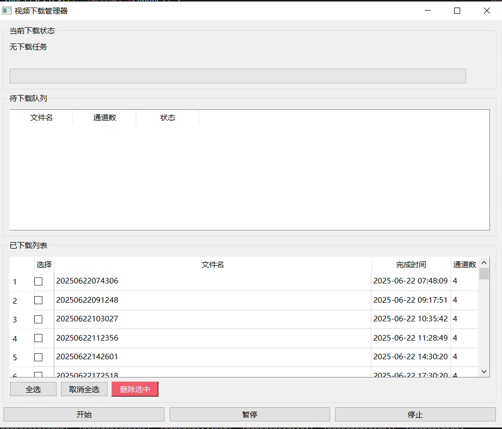

# 视频下载管理器

## 功能说明

本项目是基于海康威视 **HCNetSDK** 的视频下载管理工具，主要用于：

- **自动监听指定文件夹** 中新产生的 `*.txt` 文件，将其视为“下载任务触发文件”。
- 根据触发文件的创建时间，**自动计算需要下载的时间段**（默认：创建时间前 6 分钟到创建时间）。
- 从海康威视设备的 **4 个通道（33、34、35、36）批量下载视频文件**，按任务名分文件夹保存。
- 提供桌面 **GUI 界面**，实时显示：
  - 当前下载任务与进度。
  - 等待下载队列。
  - 已完成下载列表（可批量删除）。
- 对已完成和已删除的视频任务进行本地记录，避免重复下载。

整体流程为：

1. 监听目录 `F:\baowen`。
2. 发现新 `.txt` 文件。
3. 计算下载时间段。
4. 生成下载任务。
5. 通过 HCNetSDK 从设备下载到 `record/<任务名>` 目录。
6. 在 GUI 中显示下载进度与已完成列表。

---

## 运行环境要求

- **操作系统**：Windows（HCNetSDK 仅支持 Windows）
- **Python 版本**：建议 Python 3.8+
- **依赖库**（需提前安装）：
  - `PySide6`（图形界面）
  - `watchdog`（文件夹监控）
- **海康威视 SDK**：
  - 项目根目录下必须存在 `HCNetSDK` 文件夹。
  - 其中包含 `HCNetSDK.dll` 及其依赖（已随项目提供）。
- **摄像头 / NVR 设备参数**：
  - 默认配置在 `video_downloader.py` 中：

    ```python
    device_ip = '10.200.115.81'
    device_port = 8000
    username = 'admin'
    password = '1234asdf'
    ```

  - 如与实际设备不符，请根据实际情况修改。

---

## 目录结构说明（核心部分）

- **`main.py`**

  程序入口与 GUI 主窗口：

  - 初始化日志系统。
  - 检查 `HCNetSDK` 目录与 `HCNetSDK.dll`。
  - 启动 `DownloadManager`（下载管理器）。
  - 启动 `FileMonitor`（文件夹监控线程）。
  - 显示主界面并处理用户操作（开始 / 暂停 / 停止下载、批量删除等）。

- **`download_manager.py`**

  下载调度与任务管理：

  - 维护下载队列 `queue`。
  - 维护已完成任务 `completed_files`。
  - 维护已删除任务 `deleted_files`（记录在 `data/dropdata.csv` 中）。
  - 启动后台线程顺序下载各任务的四个通道。
  - 扫描 `record` 文件夹下已有的视频文件夹并补充到已完成列表。
  - 提供删除视频文件夹接口 `delete_video_files`。

- **`video_downloader.py`**

  与海康威视设备对接：

  - 通过 HCNetSDK 完成初始化和登录。
  - 按指定通道与时间段下载录像文件到本地。
  - 每个任务会在 `record/<任务名>/` 下保存对应通道的 `.mp4` 文件。
  - 若同名文件已存在，会跳过下载（避免重复）。

- **`file_monitor.py`**

  文件夹监控与任务触发：

  - 监听目录：默认 `F:\baowen`。
  - 对已存在和新创建的 `.txt` 文件：
    - 取其创建时间 `creation_time`。
    - 实际开始时间 = `creation_time - 6 分钟`。
    - 结束时间 = 实际开始时间 + 6 分钟。
    - 以去掉拓展名的文件名作为任务名 `filename`。
  - 通过信号将任务信息发送给 `DownloadManager.add_task`。

- **`logs/app.log`**

  程序运行日志。

- **`completed_files.json`**

  已完成下载任务记录。

- **`data/dropdata.csv`**

  记录已删除任务（防止再次下载）。

- **`HCNetSDK/`**

  海康威视 SDK 目录及其 DLL 依赖。

---

## 使用方法

### 1. 安装依赖

在项目根目录下执行（建议使用虚拟环境）：

```bash
pip install PySide6 watchdog
```

如需其他库，请根据实际报错再补充安装。

### 2. 准备海康威视 SDK

1. 确认项目根目录存在 `HCNetSDK` 文件夹。
2. 确认其中包含 `HCNetSDK.dll` 及相关 DLL、lib 文件。
3. 如需替换为其他版本 SDK，保持目录名为 `HCNetSDK`，并保持 `HCNetSDK.dll` 文件名不变。

### 3. 配置设备与路径（如有需要）

- 修改设备 IP、端口、账号密码：

  打开 `video_downloader.py`，在 `VideoDownloader.__init__` 中修改：

  ```python
  def __init__(self, device_ip='10.200.115.81', device_port=8000,
               username='admin', password='1234asdf'):
  ```

- 修改监控文件夹路径：

  打开 `file_monitor.py`，在 `FileMonitor.__init__` 中修改默认 `folder_path`：

  ```python
  def __init__(self, folder_path="F:\\baowen"):
  ```

- 修改视频保存路径：

  - `DownloadManager` 默认使用 `record` 作为根目录：`os.path.join("record", filename)`。
  - `main.py` 中额外创建了一个绝对路径目录：

    ```python
    record_dir = r"E:\\积水识别项目\\视频下载模块\\record"
    ```

  如你希望统一保存位置，可将上述路径调整为你自己的目录，或改为相对路径。

### 4. 启动程序

在项目根目录执行：

```bash
python main.py
```

程序将：

- 创建 `logs` 目录，用于日志记录。
- 创建（如不存在）`E:\\积水识别项目\\视频下载模块\\record` 目录。
- 检查 `HCNetSDK` 及 `HCNetSDK.dll` 是否存在。
- 启动 GUI 主界面。
- 启动文件夹监控线程。

---

## 界面与操作说明

启动后主界面包含以下区域：

- **当前下载状态**

  - 显示当前正在下载的任务名和通道号。
  - 显示当前通道的下载进度（0–100%）。

- **待下载队列**

  - 列出所有已触发但尚未完成的任务。
  - 列表字段：
    - 文件名（任务名）。
    - 通道数（固定为 4）。
    - 状态（`pending` / `downloading`）。

- **已下载列表**

  - 展示所有已成功下载的任务。
  - 列表字段：
    - 选择（复选框）。
    - 文件名（任务名）。
    - 完成时间。
    - 通道数。

- **控制按钮**

  - `开始`：启动下载调度线程，依次处理队列任务。
  - `暂停`：暂停下载（线程保持，暂不继续新任务）。
  - `停止`：停止下载线程并保存已完成记录。
  - `全选`：勾选已下载列表中所有任务。
  - `取消全选`：取消勾选。
  - `删除选中`：
    - 删除 `record/<任务名>` 文件夹及其所有内容。
    - 从 `completed_files.json` 中移除该记录。
    - 将该任务名写入 `data/dropdata.csv`，视为“已删除”，下次不再下载同名任务。

---

## 任务触发方式示例

1. 在被监控目录（默认 `F:\baowen`）下创建一个文本文件，例如：

   ```text
   20241221_120000.txt
   ```

2. 程序会自动：

   - 读取其**文件名（不含扩展名）**作为任务名 `filename`。
   - 获取创建时间 `creation_time`。
   - 计算下载时间段（`creation_time - 6 分钟` 到 `creation_time`）。
   - 为通道 33、34、35、36 生成下载任务。

3. 下载结果将保存到：

   ```text
   record/20241221_120000/
   ```

   目录下，内含 4 个通道对应的 `.mp4` 文件。

---

## 注意事项

- 本工具仅能在 **Windows** 下运行。
- HCNetSDK 的 DLL 及依赖必须与系统架构（32/64 位）和 Python 一致。
- 若出现 SDK 初始化失败、登录失败等错误，请检查：
  - 设备网络连通性。
  - IP / 端口 / 账号 / 密码是否正确。
  - SDK 版本与设备是否兼容。
- 删除任务后，该任务名将被记录在 `data/dropdata.csv`，**同名任务不会再被下载**。若要重新下载，需要手动修改或清空该 CSV。
